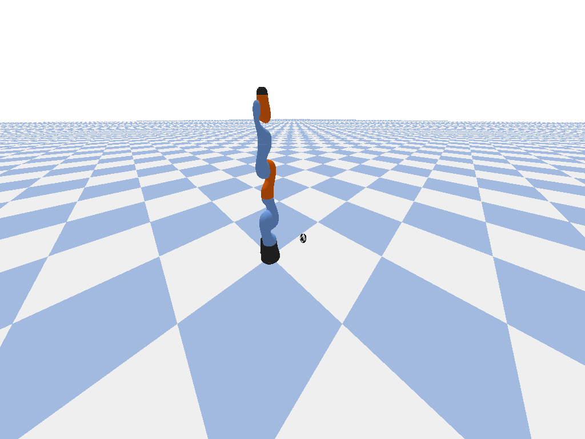

# Reinforcement Learning II - Brazo Robótico con PPO

Control de un brazo robótico Kuka IIWA de 7 articulaciones usando PPO (Proximal Policy Optimization) para alcanzar posiciones objetivo en el espacio 3D.

El entorno usa PyBullet como simulador físico y Stable-Baselines3 como framework de RL.

<p align="center">
  
</p>

## Estructura del proyecto

```
docs/
├── Cesar Mejia - Desafio Final.pdf   # Informe final del proyecto
└── Desafio final RL2 2026.pdf        # Consigna del desafío

trabajo_practico/
├── robot_arm_env.py          # Entorno custom Gymnasium del brazo robótico
├── test_ppo.py               # Script de entrenamiento con PPO
├── evaluate.py               # Evaluación del modelo guardado
├── record_episode.py         # Grabación de un episodio como GIF
├── ppo_robot_arm_v2_5cm.zip  # Modelo pre-entrenado
├── logs/                     # Logs de TensorBoard
└── monitor.csv               # Métricas de entrenamiento
```

## Requisitos

- Python 3.12+
- [uv](https://docs.astral.sh/uv/) (gestor de paquetes - opcional)

## Instalación

```bash
# Clonar el repositorio
git clone https://github.com/comejia/ceia-rl-ii-project
cd ceia-rl-ii-project
```

### Opción 1: con uv (recomendado)

```bash
uv sync
```

### Opción 2: con pip

```bash
python -m venv .venv
source .venv/bin/activate
pip install -r requirements.txt
```

## Uso

Todos los scripts se ejecutan desde la carpeta `trabajo_practico/`:

```bash
cd trabajo_practico
```

### Entrenamiento

```bash
uv run test_ppo.py
# o sin uv
python test_ppo.py
```

Entrena un agente PPO por 400.000 timesteps. El modelo se guarda como `ppo_robot_arm_v2_5cm.zip` y los logs de TensorBoard en `./logs`.

Para visualizar graficos del entrenamiento:

```bash
uv run tensorboard --logdir ./logs
# o sin uv
tensorboard --logdir ./logs
```

### Evaluación

El repositorio incluye un modelo pre-entrenado (`ppo_robot_arm_v2_5cm.zip`) listo para evaluar sin necesidad de entrenar:

```bash
uv run evaluate.py
# o sin uv
python evaluate.py
```

Ejecuta 100 episodios con el modelo guardado y muestra métricas: tasa de éxito, reward promedio, distancia final promedio y pasos promedio hasta el objetivo.

### Grabar GIF

```bash
uv run record_episode.py
# o sin uv
python record_episode.py
```

Ejecuta un episodio con renderizado visual y genera `robot_arm_success.gif` con la animación del brazo alcanzando el objetivo.

## Entorno

- **Observaciones (23 dim):** posiciones y velocidades de 7 articulaciones + posición del end-effector + posición del target + vector error
- **Acciones (7 dim):** incrementos continuos en las posiciones articulares (±0.05 rad)
- **Reward:** progreso hacia el target con shaping + bonus de +100 al alcanzarlo (distancia < 5cm)
- **Éxito:** el end-effector llega a menos de 5cm del target
